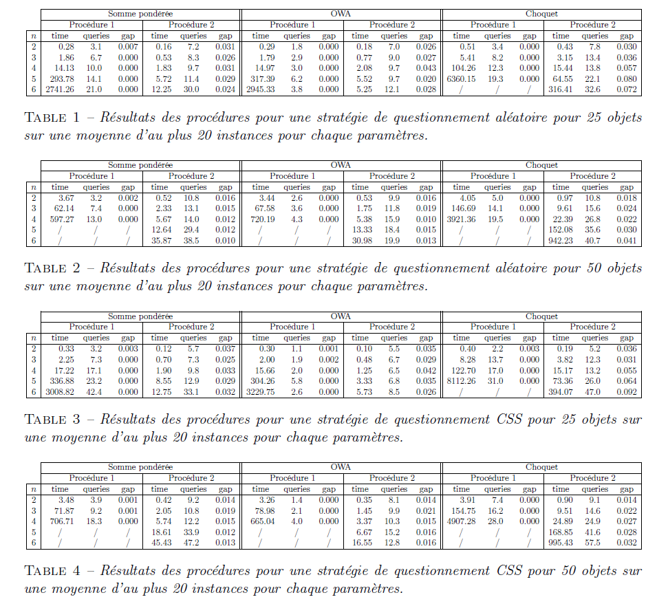

# Incremental Elicitation with Local Search for Multi-Objective Knapsack Problems

Implémentation pour l'élicitation incrémentale avec *Pareto Local Search* pour le problème du sac à dos multiobjectif  
  
## Instructions

La fonction principale permettant de tester les programmes se situe dans le fichier main.py.  
  
Pour tester les différents modèles, voici quelques exemples :  
Pour les paramètres du problème suivants :  
• 20 (premiers) objets  
• 3 critères  
• à élicitation incrémentale  
• avec agrégateur de somme pondérée  
• avec une stratégie de questionnement aléatoire  
• avec affichage sur terminal du progression des résultats  
• avec affichage graphique des solutions  
  
Veuillez entrer dans un terminal ouvert sur ce dossier :  
  
```
python main.py --nb_items 20 --nb_criteria 3 --elicitation 1 --aggregator LW --strategy RANDOM --verbose 1 --render 1
```  
  
Pour les paramètres du problème suivants :  
• 50 (premiers) objets  
• 4 critères  
• à élicitation finale (élicitation uniquement sur le dernier front de points approximés obtenu par *PLS*)  
• avec agrégateur d'intégral de Choquet  
• avec une stratégie de questionnement de solution courante (*Current Solution Strategy*)  
• pas d'affichage détaillé sur terminal du progression des résultats  
• pas d'affichage graphique des solutions  
  
Veuillez entrer sur le terminal :  
  
```
python main.py --nb_items 50 --nb_criteria 4 --elicitation 0 --aggregator CHOQ --strategy CSS --verbose 0 --render 0
```  
  
Pour plus de détails sur les arguments (notamment sur les agrégateurs possibles), veuillez entrer sur le terminal:  
  
```
python main.py --help
```  
  
Les fichiers graph.py et results.py contiennent les programmes permettant d'obtenir tous les résultats expérimentaux pour le rapport. Ces derniers sont par ailleurs enregistrés dans le dossier logs.  
  
## Résultats

Informations sur les résultats :  
  
• Procédure 1 : *PLS* suivi d'une élicitation sur le dernier front de points efficaces  
• Procédure 2 : *PLS* et élicitation incrémentale  
• *time in seconds*  
• *relative gap between the near-optimum solution provided by elicitation and the optimum solution from the MIP*  
• / indique que le temps d'éxécution a été trop long pour obtenir des résultats.  
  

  

